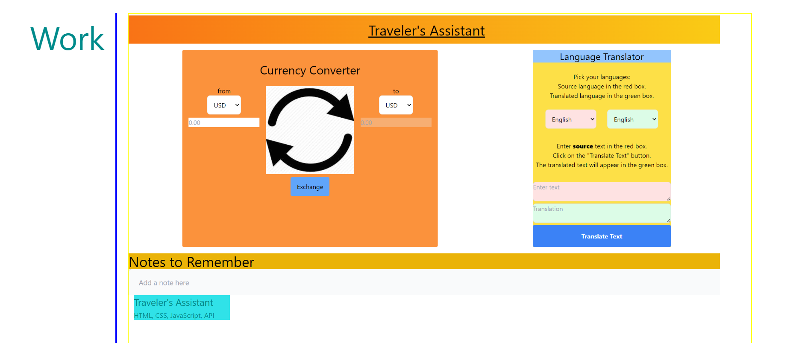

# Travelers-Assistant

## Description

This application is designed to be a compact traveler’s assistant. It was based on my personal experiences when I traveled to Costa Rica and was separated from my traveling companions. 
It is designed to assist a user who is traveling in an unfamiliar country, with simple translations and currency conversions.  The ultimate goal of this application is to be a no fuss application that would allow the user to perform simple actions that would be necessary to function in a foreign country, until arrangements could be made for more comprehensive assistance.
The combination of the language translator and currency converter will hopefully allow the user to complete simple business transactions such as buying a meal or renting a room without having to rely on “the kindness of strangers”. 
This application taught me many things. Firstly, it helped me to understand the process of accessing a third party API. It gave me my first experience coding in collaborate environment. It also gave me experience integrating and embedding code from different projects into one program package. This was also my first introduction with the styling code, tailwinds.

## Installation

Installation is not necessary as the application runs completely in the web browser.  
One accesses the url, https://boilermaker74.github.io/

This brings up my portfolio .Clicking anywhere in the work section titled Traveler's Assistance will launch the application.

## Usage

The application is composed of three major sections. 

The first section is a translator.

It provides drop down menus of 98 different languages that allows the user to choose independently a source and destination language. A text box allows the user to enter words and simple phrases. A separate textbox displays the result after the translate button is pressed.

 
The translation source is an API, Mymemory located at https://mymemory.translated.net.   The API provides some feedback for the user. If the translate button is pressed without placing text in the window, nothing happens. Likewise, if the user doesn’t choose two different languages, a message is displayed in the “translated” textbox.

 

The second section is a currency converter.

 
Two drop down menus  allows the user to pick a source currency and a destination to currency. 

The exchange rates and calculations are provided by the API, ExchangeRate-API located at  https://www.exchangerate-api.com.  Exchangerate claims to update the exchange rate as often as every sixty seconds. Therefore, the user can be confident that the rate is not obsolete. The user has 98 different currencies to reference by use of drop down menus.  
 

The user picks the two currencies to convert. The user enters the amount to be converted in the left text box. When the exchange button is pressed, the converted amount appears in the right text box. 

 

The api provides user some user feedback. When a zero is entered in the source textbox, “undefined” is displayed in the destination textbox.

 
We assigned the type of the input box as “number” and a min value of zero.  This prevents the user from entering any value other than a positive number. 
 

Lastly, the application has a textarea dedicated to recording quick notes for the user.

 
The user can type in quick notes to keep until they have the opportunity to record them permanently.

The application stores the information in local storage under the key “notes”. A keyup event listener records the textarea as a string and records it dynamically as the text is typed.  
 

 
When the application first loads, the local memory is read and the textarea is assigned whatever value is recorded. 

 ## Credits

The api’s ExchangeRate-API and Mymemory provided examples of code it their documentation.  We would also like to thank my tutor, Weng Fei Fung, for his invaluable assistance.

## License

MIT License

## Testing

A test for the application can be accomplished by using 3 different operations, circling back to see if the final result resembles the original question. For example, translating the phrase “How much are the apples” from English to German gives the response, “wie viel sind die Äpfel”. 

 
This phrase translates into French yields, “combien sont les pommes”. 
 

 Finally a translation of “combien sont les pommes”, back into English is “how much are apples”.
 

Comparing the initial phrase “How much are the apples” matched the final translation “how much apples”. The application passed this test at least.

